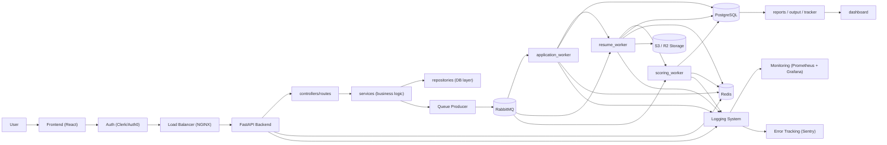

# 🚀 TASKPILOT - COMPLETE SYSTEM BLUEPRINT (PRODUCTION MASTER SPEC)

---

# 🚨 ABSOLUTE DIRECTIVE

This is a **production-grade system**, NOT a prototype, NOT a hackathon app, and NOT an MVP-grade architecture.

This file is the single source of truth for how Taskpilot must be designed, implemented, deployed, and scaled.

Codex MUST:

* follow this document exactly
* keep the architecture queue-driven and async-first
* preserve service boundaries
* not simplify hard production decisions into beginner shortcuts
* not swap real infrastructure for "easy" substitutes just because setup is harder
* not introduce hidden coupling between frontend, API, workers, and data systems

Codex MUST NOT:

* replace AWS-grade production infra with Supabase just because it is easier
* move heavy processing into API handlers
* store files locally
* put business logic in the frontend
* bypass the queue for important async work
* create architecture drift by randomly adding tools or patterns

If there is any conflict between speed and production correctness, **production correctness wins**.

---

# 🧠 CORE MISSION

Taskpilot is primarily an auto-apply platform.

Build Taskpilot so it scales from:

> **1 user -> 1,000,000+ users without rewrite**

Scaling must come from:

* adding more containers
* increasing queue capacity
* increasing worker count
* scaling Redis and PostgreSQL
* using replica-capable, partition-capable, and region-capable infrastructure without redesign

Scaling must NOT require:

* rewriting from monolith to microservices
* moving business rules from one layer to another
* changing the core async workflow
* replacing the data model every time traffic increases

---

# 🧭 SYSTEM PHILOSOPHY

Taskpilot is a queue-driven auto-apply platform.

The primary product goal is automated job application execution at scale.

Resume analysis and ATS suggestions improve application quality, but they are secondary to automated application execution.

The main reusable user asset is the application profile, not a resume editor.

The API exists to:

* authenticate the user
* validate input
* authorize the action
* perform minimal required database writes
* enqueue work
* return quickly

Workers exist to:

* process expensive or slow work
* handle retries
* isolate failures
* keep the API fast under load

Redis exists to:

* cache hot reads
* enforce rate limits
* support token/session validation caching
* reduce repeated load on downstream systems

PostgreSQL exists to:

* store the source of truth
* preserve transactional integrity
* support indexed reads and writes
* provide durable application state

S3 exists to:

* store uploaded files and generated artifacts
* keep the application stateless
* make storage independent of containers

RabbitMQ exists to:

* decouple the request path from processing
* smooth spikes in workload
* support retries and dead-letter flows
* let workers scale independently of the API

---

# ❤️ PRODUCT PRIORITIES (NEW)

Taskpilot must be loved because it saves time, reduces application friction, and gives users confidence that automation is working safely.

The user-facing product layer built on top of the queue-driven backend should prioritize:

* one-time reusable application profile
* target company / job lists
* approval mode before submit
* application evidence and proof of submission
* application tracking timeline
* duplicate-apply protection

These priorities do not change the architecture:

* API remains thin
* all heavy work stays in workers
* browser automation stays worker-only
* PostgreSQL remains the source of truth

---

# 📈 PRODUCTION SCALABILITY MODEL (MANDATORY)

Taskpilot must be built as one production architecture from the beginning.

There is exactly one architecture for this system:

* the production architecture

The production system must already support:

* horizontally scalable frontend containers
* horizontally scalable FastAPI backend containers behind a load balancer
* dedicated worker pools by queue type
* Redis-backed caching and rate limiting
* durable RabbitMQ queues with retries and dead-letter queues
* PostgreSQL primary-write topology with replica-compatible design
* S3-based object storage
* full observability across frontend, API, queue, workers, and data systems
* disaster recovery, backups, and rollback procedures

Capacity growth must be an operations problem, not an architecture problem.

That means scale is handled by:

* increasing backend replica count
* increasing worker count
* tuning RabbitMQ throughput and concurrency
* scaling Redis capacity
* scaling PostgreSQL capacity
* enabling replicas, partitions, and regional deployment on the same architecture

Non-negotiable rules:

* no API handler becomes a sync fallback for heavy work
* no direct frontend-to-worker coupling
* no in-memory state becomes a source of truth
* queue backlog is treated as a production signal and monitored aggressively
* write traffic goes only through the primary database
* the contract remains the same under all traffic levels: validate, write minimal state, queue work, return fast

---

# ⚙️ FINAL TECH STACK (LOCKED)

This is the default production stack. Do not downgrade it into easier substitutes.

## FRONTEND

* React (Vite)
* TypeScript
* Tailwind CSS
* TanStack Query (React Query)
* React Router

## BACKEND API

* Python 3.12+
* FastAPI
* Uvicorn
* Pydantic v2
* SQLAlchemy 2.x async
* Alembic
* asyncpg

## WORKERS

* Python 3.12+
* RabbitMQ consumer workers
* aio-pika or equivalent async RabbitMQ client
* SQLAlchemy 2.x async

## DATABASE

Primary database:

* PostgreSQL

Production hosting:

* AWS RDS PostgreSQL

Requirements:

* Multi-AZ in production
* automated backups enabled
* point-in-time recovery enabled
* primary-write topology with replica support

Important:

* Supabase is NOT the primary production database plan
* do NOT choose Supabase just because AWS setup is harder

## AUTHENTICATION

Use:

* Auth0

Rules:

* do not build auth manually
* do not manage passwords yourself
* use JWT/OIDC flows
* backend must verify issuer, audience, expiry, and signature

## CACHE

* Redis

Production hosting:

* AWS ElastiCache for Redis

Rules:

* Redis is not the source of truth
* losing Redis must degrade performance, not corrupt data

## QUEUE

* RabbitMQ

Production hosting:

* Amazon MQ for RabbitMQ or equivalent managed RabbitMQ

Rules:

* RabbitMQ is the queue system for this architecture
* do not introduce Kafka unless this document is intentionally revised

## FILE STORAGE

* AWS S3

Rules:

* all user files go to S3
* backend stores URLs and metadata only
* no local disk persistence

## LOAD BALANCER

* AWS Application Load Balancer (ALB)

## EDGE / CDN

* CloudFront in front of frontend assets in production

## CONTAINERIZATION

* Docker is mandatory
* Docker Compose for local development
* ECS Fargate or Kubernetes for production container orchestration

Recommended default:

* ECS Fargate

## OBSERVABILITY

* JSON structured logs
* OpenTelemetry for tracing
* Prometheus for metrics
* Grafana for dashboards
* Sentry for error tracking

---

# 🧱 HIGH-LEVEL ARCHITECTURE

## CANONICAL SYSTEM FLOW



## ARCHITECTURE INTERPRETATION RULES

The diagram above is not illustrative only. It defines the actual production responsibilities of each layer.

Important clarifications:

* the backend must perform the minimal PostgreSQL write before publishing to RabbitMQ
* `controllers/routes` handle HTTP concerns only
* `services` contain orchestration and business rules
* `repositories` are the database-access layer only
* the queue producer is called from the service layer, not from the frontend
* all workers may update PostgreSQL status as part of their job lifecycle
* Redis is shared infrastructure for API and workers, not a worker-only dependency
* object storage is the file system of the platform; local disk is never durable storage

## CANONICAL REQUEST PATH

Request path:

User
-> Frontend
-> Load Balancer
-> FastAPI Backend (stateless)
-> controllers/routes
-> services
-> repositories
-> PostgreSQL minimal write
-> services
-> Queue Producer
-> RabbitMQ enqueue
-> Immediate API response
-> Workers process async
-> PostgreSQL update
-> User sees updated state

## CANONICAL STORAGE PATH

Storage path:

User file
-> Frontend requests signed upload URL
-> Backend validates and creates signed S3 upload
-> Frontend uploads directly to S3
-> Backend stores S3 URL and metadata only
-> resume worker reads file from object storage for processing
-> any derived artifacts are written back to object storage, not local disk

## OBSERVABILITY PROPAGATION PATH

Observability path:

Frontend request_id
-> Backend request_id + trace_id
-> Queue message carries request_id + trace context
-> Worker logs and traces same identifiers

## PRODUCTION FLOW CORRECTIONS

The following rules are mandatory so the real implementation matches the architecture correctly:

* the API must not wait for `application_worker`, `resume_worker`, or `scoring_worker` to finish before returning
* `application_worker` may update application state such as `queued -> processing`
* `resume_worker` may update state such as `processing -> resume_processed`
* `scoring_worker` may update state such as `resume_processed -> scored -> completed`
* any worker may write failure state and failure reason to PostgreSQL if its step fails
* the dashboard must read durable state from PostgreSQL-backed APIs, not from in-memory worker state
* file upload happens through presigned object-storage upload, not through permanent storage on the backend container
* if R2 is ever used instead of S3, it must preserve the same object-storage contract, signed URL model, and non-local-storage rule

---

# 🧩 NON-NEGOTIABLE ARCHITECTURE RULES

1. Backend is stateless.
2. Heavy work never runs in the API request path.
3. All important async work must go through RabbitMQ.
4. Files must be stored in S3, never on container disk.
5. Database is the source of truth.
6. Redis is only a performance and control layer.
7. Services communicate through explicit APIs and queue contracts.
8. Observability must exist from day one.
9. Retries and DLQ are mandatory, not optional.
10. Production decisions must favor scalability, debuggability, and fault isolation.

---

# 📁 PROJECT STRUCTURE (STRICT)

The project must follow this structure:

```text
taskpilot/
  frontend/
  backend/
  workers/
  shared/
  infra/
  codex.md
```

The folders have strict responsibilities.

## `frontend/`

Purpose:

* user interface
* route handling
* auth integration in the browser
* file upload orchestration
* API consumption
* view state and client state

Must contain:

* `src/`
* `public/`
* `package.json`
* `vite.config.*`
* Tailwind config
* Dockerfile

Must NOT contain:

* backend business logic
* direct database access
* worker logic
* secret server credentials

## `backend/`

Purpose:

* API layer
* validation
* authorization
* minimal transactional writes
* queue publishing
* signed S3 URL generation
* read endpoints
* health endpoints
* observability middleware

Suggested internal structure:

```text
backend/
  app/
    api/
    core/
    middleware/
    models/
    schemas/
    repositories/
    services/
    observability/
    main.py
  migrations/
  tests/
  Dockerfile
  requirements.txt
```

Must NOT contain:

* long-running resume parsing
* scoring computations
* blocking background work
* file persistence on local disk

## `workers/`

Purpose:

* consume queue messages
* execute CPU-heavy or IO-heavy async jobs
* manage retries and dead-letter flows
* update persistent status in PostgreSQL
* emit worker metrics and logs

Suggested internal structure:

```text
workers/
  app/
    consumers/
    processors/
    services/
    retries/
    observability/
    main.py
  tests/
  Dockerfile
  requirements.txt
```

Must NOT contain:

* HTTP API endpoints
* frontend code
* local-only file storage assumptions

## `shared/`

Purpose:

* shared contracts, not shared runtime coupling

Allowed contents:

* OpenAPI specs
* JSON schemas
* queue event schemas
* constants and enums that can be generated into each language
* documentation for payload contracts

Important:

* do not try to directly import Python code into TypeScript or TypeScript code into Python
* shared means shared contracts, not language-crossed runtime hacks

## `infra/`

Purpose:

* deployment and infrastructure definitions

Suggested contents:

```text
infra/
  docker/
  compose/
  ecs/
  terraform/
  monitoring/
  rabbitmq/
  nginx/
```

Must contain:

* Docker and Compose definitions
* production deployment manifests or infrastructure-as-code
* monitoring setup
* queue and infrastructure configs

---

# 🌍 ENVIRONMENTS

There are three official environments:

## LOCAL

Purpose:

* developer productivity
* full stack integration on one machine

Infra:

* Docker Compose
* local frontend container or local Vite dev server
* local backend container
* local worker container
* local Postgres
* local Redis
* local RabbitMQ

Rules:

* local should mimic production architecture closely
* local can use local Postgres/Redis/RabbitMQ containers
* local must still use S3-compatible or mocked signed upload flow, not local file persistence as the "real" path

## STAGING

Purpose:

* release verification
* integration testing
* migration validation

Rules:

* staging architecture must resemble production
* staging must have separate database, Redis, RabbitMQ, and S3 buckets
* no shared production data

## PRODUCTION

Purpose:

* live traffic only

Rules:

* managed cloud infrastructure
* Multi-AZ where applicable
* monitoring, alerting, backups, and rollback are mandatory

---

# 🖥️ FRONTEND BLUEPRINT

## ROLE OF THE FRONTEND

The frontend is responsible for:

* rendering the user experience
* collecting user input
* invoking backend APIs
* handling auth session state from Auth0 SDK
* orchestrating direct file upload to S3
* showing job/application status

The frontend is NOT responsible for:

* running resume analysis
* calculating scores
* holding sensitive server secrets
* bypassing the backend for protected business actions

## FRONTEND ARCHITECTURE RULES

1. Use React Query for server state.
2. Keep UI state local to components or feature hooks.
3. Keep network calls in a dedicated API/service layer.
4. Keep route guards tied to the auth provider.
5. Keep components focused on rendering and interaction.
6. Do not bury business rules inside JSX.

## RECOMMENDED FRONTEND STRUCTURE

```text
frontend/
  src/
    app/
    routes/
    pages/
    features/
    components/
    hooks/
    services/
    lib/
    types/
    styles/
```

## FRONTEND DATA FLOW

For async submission flows:

1. user selects file
2. frontend requests signed upload URL from backend
3. frontend uploads file directly to S3
4. frontend submits metadata + S3 URL to backend
5. backend writes minimal application state and queues processing
6. frontend receives quick response
7. frontend polls or refetches status using React Query

## FRONTEND REQUEST RULES

Every write request should send:

* `Authorization: Bearer <token>`
* `X-Request-ID`
* `Idempotency-Key` for create/mutate endpoints where duplicate submission is possible

## FRONTEND ERROR HANDLING

Frontend must:

* show actionable user-facing errors
* avoid exposing internal stack traces
* surface upload failures separately from application processing failures
* retry safe reads where appropriate
* not infinitely retry failed writes without user intent

## FRONTEND PERFORMANCE RULES

* code-split route-level bundles
* lazy load heavy pages
* cache read endpoints through React Query
* invalidate queries after successful mutations
* keep critical path bundles small

---

# 🧪 BACKEND API BLUEPRINT

## ROLE OF THE BACKEND

The backend is the control plane for business actions.

The backend must:

* authenticate requests
* validate inputs using Pydantic
* authorize access
* perform minimal database writes
* publish jobs to RabbitMQ
* create signed S3 upload URLs
* expose read endpoints
* expose health and metrics endpoints

The backend must NOT:

* parse files inline
* do heavy scoring inline
* do large external scraping inline
* block the request path waiting for workers

## BACKEND LAYERING

The backend should be split into:

* routers/controllers
* schemas
* services
* repositories
* models
* infrastructure/clients

Responsibilities:

* routers: HTTP parsing, status codes, dependency injection
* schemas: request/response validation
* services: orchestration and business rules
* repositories: database access only
* infrastructure clients: queue, Redis, S3, external services

## BACKEND REQUEST LIFECYCLE

For a write endpoint:

1. receive request
2. attach or generate request_id
3. authenticate JWT
4. authorize user
5. validate payload
6. open DB transaction
7. perform minimal write
8. publish queue message
9. commit transaction
10. return `202 Accepted` or appropriate success status

## BACKEND RESPONSE RULES

Use:

* `200 OK` for normal reads
* `201 Created` only when synchronous creation is fully complete
* `202 Accepted` for queued async operations
* `400` for validation errors
* `401` for unauthenticated requests
* `403` for unauthorized requests
* `404` for missing resources
* `409` for idempotency conflicts or conflicting state
* `429` for rate limited requests
* `500+` only for actual server failures

## INITIAL CORE ENDPOINTS

Suggested endpoints:

* `POST /v1/uploads/presign`
* `POST /v1/applications`
* `GET /v1/applications/{application_id}`
* `GET /v1/applications`
* `GET /v1/jobs`
* `GET /v1/jobs/{job_id}`
* `GET /health/live`
* `GET /health/ready`
* `GET /metrics`

## HEALTH ENDPOINT RULES

`/health/live`:

* returns success if process is alive

`/health/ready`:

* checks DB connectivity
* checks Redis availability if required for request path
* checks RabbitMQ connectivity if publishing is required for writes

## IDEMPOTENCY RULE

Any endpoint that creates an application or expensive async workflow must support idempotency.

Minimum rule:

* the same `Idempotency-Key` from the same authenticated user must not create duplicate logical jobs

Persistence rule:

* idempotency must be persisted in PostgreSQL, not only Redis

---

# 🧵 CORE FLOW (DETAILED)

## APPLICATION SUBMISSION FLOW

1. User signs in through Auth0.
2. Frontend obtains access token.
3. Frontend asks backend for a signed S3 upload URL.
4. Backend validates user and file metadata and returns a signed URL.
5. Frontend uploads the resume directly to S3.
6. Frontend calls `POST /v1/applications` with:
   * `job_id`
   * `resume_url`
   * metadata
   * `X-Request-ID`
   * `Idempotency-Key`
7. Backend validates JWT and payload.
8. Backend creates the minimal application record in PostgreSQL with status like `queued`.
9. Backend publishes an `application.created` message to RabbitMQ only after the minimal persistent record exists.
10. Backend returns immediately with `202 Accepted` and the application ID.
11. `application_worker` consumes the queue message.
12. `application_worker` updates PostgreSQL status to a processing state and publishes follow-up work when appropriate.
13. `resume_worker` reads the stored file from S3 or R2 and performs resume extraction or enrichment steps.
14. `resume_worker` updates PostgreSQL status and publishes follow-up work such as scoring.
15. `scoring_worker` calculates score or ranking outputs, updates PostgreSQL with final status and results, and records failures durably if needed.
16. Frontend reads updated state through polling and refetching until the latest durable state is visible.

## API GOLDEN RULE

The backend must stop at:

* validate
* write minimal state
* queue work
* return

It must not continue into:

* heavy file parsing
* scoring
* expensive external calls
* large document processing

---

# 📨 QUEUE DESIGN (DETAILED)

## REQUIRED QUEUES

* `application_queue`
* `resume_queue`
* `scoring_queue`

## REQUIRED DEAD-LETTER QUEUES

* `application_queue_dlq`
* `resume_queue_dlq`
* `scoring_queue_dlq`

## QUEUE TOPOLOGY

Recommended:

* one direct exchange for application workflow events
* explicit routing keys for each queue
* dead-letter exchange for failed messages

Example routing keys:

* `application.created`
* `resume.process`
* `score.calculate`

## MESSAGE ENVELOPE

Every queue message should include:

* `event_id`
* `event_name`
* `request_id`
* `trace_id`
* `user_id`
* `resource_id`
* `idempotency_key`
* `attempt`
* `created_at`
* `version`
* `payload`

## RETRY RULES

Retries are mandatory.

Default policy:

* max 3 attempts
* exponential backoff
* send to DLQ after final failure

Recommended backoff sequence:

* attempt 1 retry after 30 seconds
* attempt 2 retry after 5 minutes
* attempt 3 retry after 30 minutes

## IDEMPOTENT JOB RULE

Workers must be idempotent.

That means:

* receiving the same message twice must not corrupt state
* duplicate processing must be safe
* database updates must guard against double-completion

## ACK / NACK RULES

* ack only after the worker has safely committed any required DB changes
* nack or route to retry queue on transient failures
* send to DLQ on permanent failures or after retry exhaustion

## QUEUE FAILURE RULES

No message can disappear silently.

A failed message must result in one of the following:

* successful retry
* durable failure state in DB
* dead-letter queue entry
* alert for operator visibility

---

# 👷 WORKER BLUEPRINT

## ROLE OF WORKERS

Workers are responsible for all heavy or slow operations.

Examples:

* resume parsing
* scoring
* external enrichment
* expensive post-processing
* notification fan-out if needed

## WORKER DESIGN RULES

1. Workers must be horizontally scalable.
2. Workers must be stateless between jobs.
3. Workers must log every lifecycle step.
4. Workers must update application state durably in PostgreSQL.
5. Workers must handle graceful shutdown.
6. Workers must support retry and DLQ behavior.

## WORKER CONCURRENCY

Concurrency must be configurable by environment variable.

Separate concurrency by queue type:

* resume processing may be lower concurrency if CPU-heavy
* scoring may be higher concurrency if lightweight
* application intake may be moderate concurrency

## WORKER STATE TRANSITIONS

A worker should update state clearly.

Example application status progression:

* `queued`
* `processing`
* `scoring`
* `completed`
* `failed`

State changes must be:

* durable
* timestamped
* logged

## WORKER SHUTDOWN RULE

On shutdown:

* stop accepting new messages
* finish in-flight work where possible
* ensure unacked jobs are requeued safely

---

# 🗄️ DATABASE DESIGN (DETAILED)

## DATABASE PRINCIPLES

* PostgreSQL is the source of truth
* all timestamps use `timestamptz`
* all IDs should be UUIDs
* use explicit constraints
* use indexes intentionally
* use migrations for every schema change

## CORE DOMAIN TABLES (MANDATORY)

The minimum core domain tables are:

* `users`
* `jobs`
* `applications`
* `scores`

Additional operational tables are allowed for production reliability, but these four are mandatory.

## `users`

Required fields:

* `id`
* `auth_provider`
* `auth_subject`
* `email`
* `full_name`
* `created_at`
* `updated_at`

Rules:

* `auth_subject` must be unique
* `email` should be unique where product rules allow

Recommended indexes:

* unique index on `auth_subject`
* unique index on `email`

## `jobs`

Required fields:

* `id`
* `external_source`
* `external_job_id`
* `company_name`
* `title`
* `location`
* `employment_type`
* `status`
* `apply_url`
* `created_at`
* `updated_at`

Rules:

* avoid duplicate external jobs from the same source
* normalize fields used for filtering

Recommended indexes:

* unique index on (`external_source`, `external_job_id`)
* index on `status`
* index on `created_at`

## `applications`

Required fields:

* `id`
* `user_id`
* `job_id`
* `status`
* `resume_url`
* `request_id`
* `idempotency_key`
* `failure_reason`
* `created_at`
* `updated_at`
* `queued_at`
* `processed_at`

Rules:

* `resume_url` stores S3 location or logical URL only
* `status` must be an explicit enum-like constrained value
* repeated submissions must respect idempotency rules

Required indexes:

* index on `user_id`
* index on `job_id`
* index on `status`

Recommended indexes:

* composite index on (`user_id`, `status`)
* index on `created_at`
* unique or constrained pattern for idempotency

## `scores`

Required fields:

* `id`
* `application_id`
* `score`
* `score_breakdown`
* `model_version`
* `created_at`
* `updated_at`

Rules:

* one application may have one current score record or versioned score records depending product needs
* score payloads can use JSONB for structured breakdowns

Recommended indexes:

* index on `application_id`
* index on `created_at`

## OPERATIONAL TABLES (RECOMMENDED)

Recommended supporting tables:

* `idempotency_keys`
* `audit_events`
* `failed_jobs`
* `notifications`

These are not a replacement for the required core tables.

## DATABASE WRITE RULES

* keep transactions short
* do not hold transactions open during external network calls
* do not wait on workers inside DB transactions
* update state atomically where possible

## DATABASE CAPACITY RULES

* all writes go to the primary database
* read-heavy endpoints may use replicas where read consistency rules allow
* indexes must be tuned for the real query patterns of jobs, applications, and scores
* partitioning is allowed for large write-heavy tables such as `applications` without changing the architecture
* schema growth must remain migration-driven and operationally safe

---

# ⚡ REDIS DESIGN (DETAILED)

Redis is a support layer, not the source of truth.

## REDIS USE CASES

* caching hot job reads
* caching frequently accessed dashboard queries
* rate limiting counters
* token/session validation cache
* short-lived coordination locks where necessary

## REDIS RULES

* every cache entry must have a TTL
* cache invalidation must be explicit after writes
* Redis outage must not corrupt persistent data
* if Redis is down, API may become slower but still remain correct wherever possible

## DO NOT USE REDIS FOR

* permanent user records
* the only copy of job/application state
* file storage
* irreplaceable workflow state

---

# 🚦 RATE LIMITING

Rate limiting is mandatory at two levels:

* per user
* per IP

## IMPLEMENTATION RULE

Use Redis-backed counters or sliding-window logic.

## REQUIRED RATE-LIMITED AREAS

* login-sensitive endpoints if applicable
* file upload URL generation
* application submission
* expensive read endpoints

## RATE LIMIT BEHAVIOR

On limit exceeded:

* return `429 Too Many Requests`
* include retry guidance if practical
* log the event in structured form

---

# 📦 FILE STORAGE DESIGN

## HARD RULE

Never store user files locally on backend or worker containers.

Only store:

* S3 object key
* S3 URL or logical storage URL
* metadata in PostgreSQL

## UPLOAD FLOW

1. backend validates upload request
2. backend creates signed S3 upload URL
3. frontend uploads directly to S3
4. backend stores resulting object reference

## STORAGE RULES

* use private S3 buckets for resumes
* use signed access when private download is needed
* enable bucket versioning
* enable server-side encryption
* apply lifecycle rules where needed

## FILE NAMING RULE

Use deterministic or namespaced keys, for example:

* `resumes/{user_id}/{application_id}/{timestamp}-{filename}`

This makes storage auditable and avoids collisions.

---

# 🔐 SECURITY (DETAILED)

## AUTHENTICATION

Use Auth0.

Backend must validate:

* JWT signature
* issuer
* audience
* expiry
* token type/claims required by the API

## AUTHORIZATION

Authorization must be enforced server-side.

Examples:

* user can only view their own applications
* admin routes require explicit roles/permissions

## INPUT VALIDATION

* validate every request with Pydantic
* reject malformed payloads early
* sanitize user-controlled strings before unsafe usage

## TRANSPORT SECURITY

* HTTPS only in production
* secure cookies only if cookies are used
* HSTS enabled at edge/load balancer when appropriate

## SECRET MANAGEMENT

Use a real secret manager.

Examples:

* AWS Secrets Manager
* AWS SSM Parameter Store

Secrets must NOT be:

* hardcoded in code
* committed to git
* stored in frontend bundles

## DATA PROTECTION

* encrypt data in transit
* encrypt data at rest
* avoid logging sensitive PII
* restrict S3 bucket access with least privilege

## CORS RULE

Use an explicit allowlist.

Do not use broad wildcard CORS for authenticated production APIs.

---

# 🌍 STATELESS DESIGN

Backend and workers must be stateless.

Allowed in memory:

* configuration loaded at startup
* DB/Redis/RabbitMQ connection pools
* per-request objects
* short-lived computation for the current request or job

Not allowed in memory as system state:

* canonical user state
* application workflow state
* queued jobs that exist nowhere else
* uploaded files

If a container dies, a replacement container must be able to continue operating without missing critical state.

---

# 📊 LOGGING & OBSERVABILITY (FULL SPEC)

## GOAL

* trace every request
* debug failures quickly
* understand throughput and latency
* monitor queue health
* identify regressions before users do

## LOGGING FORMAT

JSON logs only.

Every service must emit structured logs.

## MINIMUM LOG FIELDS

* `timestamp`
* `level`
* `service`
* `environment`
* `request_id`
* `trace_id`
* `span_id`
* `user_id` when available
* `message`

## REQUEST LOGS

Required fields:

* `request_id`
* `user_id`
* `method`
* `path`
* `status_code`
* `latency_ms`
* `client_ip`

## EVENT LOGS

Examples:

* `application_created`
* `job_queued`
* `resume_processing_started`
* `score_calculated`

## ERROR LOGS

Required fields:

* `error_message`
* `error_type`
* `stack_trace`
* `request_id`
* `trace_id`

## WORKER LOGS

Examples:

* `job_received`
* `job_started`
* `job_completed`
* `job_failed`
* `job_sent_to_dlq`

Required worker fields:

* `queue_name`
* `event_name`
* `resource_id`
* `attempt`

## REQUEST TRACING

The same request identity must flow across:

* frontend
* backend
* queue message
* worker

Recommended headers:

* `X-Request-ID`
* W3C Trace Context headers where tracing is enabled

## METRICS

Track at minimum:

* request rate
* p50 latency
* p95 latency
* error rate
* queue depth
* queue processing rate
* worker failure rate
* DB connection pool usage
* Redis health

## PROMETHEUS METRICS EXAMPLES

* `http_requests_total`
* `http_request_duration_seconds`
* `queue_messages_ready`
* `worker_jobs_total`
* `worker_job_duration_seconds`
* `worker_job_failures_total`
* `db_pool_in_use`

## ALERTS

Trigger alerts on:

* sustained high 5xx rate
* p95 API latency above threshold
* queue backlog above threshold
* DLQ growth
* worker crash loops
* DB connection exhaustion
* Redis unavailable

## DISTRIBUTED TRACING

Use:

* OpenTelemetry

Tracing should cover:

* request entry
* DB calls
* queue publish
* worker consume
* worker processing spans

## ERROR TRACKING

Use:

* Sentry

Rules:

* send backend exceptions
* send worker exceptions
* send important frontend production errors

## LOG STORAGE

Recommended production stack:

* CloudWatch for ingestion and retention
* Loki + Grafana or ELK for search and dashboards

---

# 🚨 FAILURE HANDLING

Failure handling is a first-class feature.

## REQUIRED FAILURE CONTROLS

* retries
* dead-letter queues
* explicit failure states in PostgreSQL
* error logs
* alerts

## TRANSIENT FAILURE HANDLING

Examples:

* temporary network timeout
* RabbitMQ reconnect issue
* Redis timeout
* rate-limited downstream dependency

Behavior:

* retry with backoff
* log structured context
* do not mark final failure prematurely

## PERMANENT FAILURE HANDLING

Examples:

* invalid file format
* missing required data
* unauthorized access to resource
* unrecoverable schema mismatch

Behavior:

* mark the job/application as failed
* record a clear failure reason
* emit error tracking
* optionally move message to DLQ if applicable

## NO SILENT FAILURES

Every failure must be visible in at least one of:

* PostgreSQL state
* logs
* Sentry
* DLQ
* alerting

---

# 💾 BACKUPS & DISASTER RECOVERY

## DATABASE

Required:

* daily automated backups
* point-in-time recovery
* restore testing on a schedule

## S3

Required:

* versioning enabled
* bucket lifecycle rules
* restricted deletion policies

## REDIS

Required:

* choose managed Redis persistence and backup settings appropriate for environment
* never rely on Redis as the only copy of important data

## RABBITMQ

Required:

* durable queues
* persistent messages where needed
* operational monitoring and backup strategy at the managed service level

## DISASTER RECOVERY RULE

Backups are not enough.

The team must also know:

* how to restore
* how long restore takes
* what data loss window is acceptable

---

# 🐳 DOCKER & DEPLOYMENT

## REQUIRED SERVICES

At minimum, the system contains:

* `frontend`
* `backend`
* `workers`
* `postgres`
* `redis`
* `rabbitmq`

## DOCKER RULES

* every service gets its own Dockerfile
* images should be multi-stage where useful
* images should be minimal and production-safe
* healthchecks must exist

## LOCAL DEVELOPMENT

Use Docker Compose to run:

* frontend
* backend
* workers
* postgres
* redis
* rabbitmq

## PRODUCTION DEPLOYMENT

Production AWS deployment:

* ECR for images
* ECS Fargate for frontend, backend, and workers
* ALB in front of services
* RDS PostgreSQL
* ElastiCache Redis
* Amazon MQ RabbitMQ
* S3 for file storage

## ROLLOUT RULES

Deployment must support:

* zero-downtime backend rollout where possible
* migration-first or carefully ordered releases
* rollback to previous stable image
* smoke tests after deploy

## DATABASE MIGRATION RULE

All schema changes must go through versioned migrations.

Never:

* patch production schema manually as the normal process
* deploy schema-dependent code before required migrations are safely applied

---

# 🔁 CI/CD & RELEASE SAFETY

Every production release should pass:

* linting
* unit tests
* integration tests
* build checks
* migration validation
* container build
* smoke tests in staging or post-deploy

Recommended release sequence:

1. run tests
2. build images
3. push images
4. apply migrations
5. deploy backend
6. deploy workers
7. deploy frontend
8. run smoke tests
9. monitor logs, metrics, and alerts

---

# ✅ TESTING STRATEGY

## UNIT TESTS

Cover:

* business services
* repositories
* queue publisher helpers
* payload validation

## INTEGRATION TESTS

Cover:

* API + Postgres
* API + RabbitMQ publish
* worker + RabbitMQ consume
* worker + Postgres update
* signed upload flow

## CONTRACT TESTS

Cover:

* queue payload schema compatibility
* API response shape compatibility

## END-TO-END TESTS

Cover:

* auth
* upload
* application submission
* async processing completion

## LOAD TESTS

Cover:

* high read traffic
* bursty application submission traffic
* worker backlog behavior

---

# 🧠 DESIGN PRINCIPLES

* async-first
* queue-driven
* horizontally scalable
* loosely coupled
* stateless services
* explicit contracts
* observable by default
* failure-aware by design

---

# 🚫 FORBIDDEN

The following are forbidden unless this document is intentionally revised:

* synchronous heavy processing in API handlers
* storing files locally
* mixing frontend and backend responsibilities
* skipping queue-driven processing for convenience
* using Redis as the system of record
* storing critical state only in memory
* silent failure paths
* ad hoc architecture changes without updating this file
* replacing AWS-grade components with easier substitutes just to avoid complexity

---

# 🤖 CODEX IMPLEMENTATION RULES

Codex MUST:

1. preserve the folder structure
2. follow async design
3. keep services decoupled
4. implement retries and DLQ behavior
5. log every critical action in structured JSON form
6. propagate request IDs through API and queue boundaries
7. keep the backend stateless
8. keep worker logic out of API routes
9. keep file storage on S3 only
10. keep schema changes migration-based
11. update this document if architecture intentionally changes

Codex MUST NOT:

1. invent a new architecture without approval
2. move processing into the API because it is faster to code
3. add direct DB access to the frontend
4. bypass authentication rules
5. use local filesystem as durable storage
6. remove observability because it feels optional

---

# 🔥 FINAL GUARANTEE

If this document is followed correctly:

* the system can scale from small traffic to very large traffic without rewrite
* the API remains fast because heavy work is offloaded
* scaling is mostly a matter of adding containers and managed capacity
* failures are visible and recoverable
* infrastructure can evolve without breaking the core architecture

The guarantee is not:

* "it will never need tuning"

The real guarantee is:

* no major architectural rewrite should be needed to support serious scale

---

# PRODUCT LAYER ARCHITECTURE (NEW)

Taskpilot is an AI-powered job application automation platform that:

* analyzes resumes
* finds jobs
* tailors resumes per job
* generates applications
* optionally auto-applies
* tracks outcomes

## USER JOURNEY

Canonical product journey:

User
-> Profile
-> Resume
-> Job Discovery
-> Matching
-> Optimization
-> Apply
-> Track

Product-layer rules:

* this extends, not replaces, the existing async core
* profile and resume data are durable platform inputs
* AI outputs are artifacts produced in workers
* tracking is durable in PostgreSQL, not local files

---

# CORE DOMAINS EXTENSION (NEW)

This section extends, and does not replace, existing core tables (`users`, `jobs`, `applications`, `scores`).

## NEW TABLE: `user_profiles`

Purpose:

* store the durable, reusable application profile used for company targeting and auto-apply execution
* centralize reusable answers needed across many career pages
* support ATS improvement context without making resume editing the primary asset

Required fields:

* `id`
* `user_id`
* `full_name`
* `email`
* `phone`
* `location`
* `linkedin_url` (nullable)
* `portfolio_url` (nullable)
* `work_authorization`
* `visa_status` (nullable)
* `skills` (JSONB or normalized relation)
* `experience_summary` (text)
* `preferred_locations` (JSONB or normalized relation)
* `preferred_roles` (JSONB or normalized relation)
* `preferred_salary_min`
* `preferred_salary_max`
* `consent_flags` (JSONB)
* `demographic_fields` (JSONB, optional)
* `created_at`
* `updated_at`

Rules:

* one active profile per user by default (versioning allowed)
* profile updates must be timestamped and auditable
* profile data must be reusable across many target applications
* demographic or sensitive fields are optional and may only be used with explicit user consent when a target form requires them
* profile is the canonical source for repeated application answers such as location, contact data, work authorization, and role preferences
* profile completeness guidance should help users understand what is missing before they start automated applications

Recommended indexes:

* unique index on `user_id` for active profile
* GIN index on `skills` if JSONB

## NEW TABLE: `job_sources`

Purpose:

* define ingestion origins and source-specific fetch/scrape configuration

Required fields:

* `id`
* `source_name`
* `company_name`
* `careers_url`
* `source_type` (`api`, `rss`, `scrape`)
* `scraping_config` (JSONB)
* `is_active`
* `created_at`
* `updated_at`

Rules:

* source configs are versionable and must support safe rollout
* credentials/secrets referenced by key, never stored in plain text

Recommended indexes:

* index on `is_active`
* index on `source_type`

## NEW TABLE: `job_listings`

Purpose:

* store normalized, searchable jobs fetched from sources

Required fields:

* `id`
* `job_id` (external identifier where available)
* `source_id` (FK -> `job_sources.id`)
* `title`
* `description`
* `requirements`
* `company`
* `location`
* `apply_url`
* `status`
* `ingested_at`
* `created_at`
* `updated_at`

Rules:

* deduplicate on (`source_id`, `job_id`) where external job id exists
* keep raw payload separately if needed for audit/debug
* normalize fields used by filtering, matching, and scoring

Recommended indexes:

* unique index on (`source_id`, `job_id`) where `job_id` is not null
* index on `status`
* index on `created_at`
* full-text search index on `title`, `description`, `requirements`

## NEW TABLE: `tailored_resumes`

Purpose:

* store AI-optimized resume artifacts generated per application/job context

Required fields:

* `id`
* `application_id` (FK -> `applications.id`)
* `base_resume_id` (logical identifier or FK to resume artifact record)
* `tailored_resume_url` (S3 URL/object reference)
* `job_id` (FK -> `jobs.id` or `job_listings.id` based on flow)
* `ai_version`
* `optimization_summary` (JSONB)
* `created_at`
* `updated_at`

Rules:

* all files stored in S3; DB stores references only
* multiple versions allowed, one active version should be explicit

Recommended indexes:

* index on `application_id`
* index on `job_id`
* index on `created_at`

## NEW TABLE: `application_events`

Purpose:

* store immutable workflow history for tracking, analytics, and debugging

Required fields:

* `id`
* `application_id` (FK -> `applications.id`)
* `event_type`
* `from_status`
* `to_status`
* `event_payload` (JSONB)
* `request_id`
* `trace_id`
* `created_at`

Rules:

* append-only event model for durable history
* complements current-state tables and does not replace them

Recommended indexes:

* index on `application_id`
* index on `event_type`
* index on `created_at`

---

# AI WORKFLOW PIPELINE (NEW)

This section defines the Claude-style, mode-based, artifact-driven equivalent for Taskpilot while preserving queue-driven architecture.

## INPUT LAYER

Inputs are:

* resume (`cv.md` equivalent logical artifact)
* profile (`profile.yml` equivalent logical artifact)
* job description (URL or text)

All inputs are normalized and persisted through API write + queue enqueue, not processed deeply in API handlers.

## PROCESSING LAYER (AI + WORKERS)

Stages:

* resume extraction
* job parsing
* matching
* optimization
* scoring

Each stage runs as worker-executed queue jobs with idempotent processing rules.

## OUTPUT LAYER

Outputs include:

* report (markdown-style output persisted as DB data and optionally S3 artifact)
* optimized resume (PDF in S3)
* tracking entry (PostgreSQL)

## TRACKING LAYER

Tracking is stored in PostgreSQL tables (for example `applications`, `scores`, `application_events`), not local `.md` or `.tsv` files.

## CLAUDE-SYSTEM TO TASKPILOT MAPPING

* `modes/*.md` -> worker processors and queue contracts
* skill router -> API validation + queue routing + worker dispatch
* TSV tracking -> normalized relational tables
* markdown outputs -> structured DB records with optional object-storage artifacts

---

# WORKER ARCHITECTURE EXTENSION (NEW)

All new heavy or slow workflows remain queue-driven and worker-executed.

## NEW QUEUES (MANDATORY)

* `job.ingest`
* `job.match`
* `resume.optimize`
* `report.generate`
* `application.auto_apply`
* `tracking.update` (recommended for asynchronous status/event ingestion)

## NEW QUEUE DLQS (MANDATORY)

* `job.ingest.dlq`
* `job.match.dlq`
* `resume.optimize.dlq`
* `report.generate.dlq`
* `application.auto_apply.dlq`
* `tracking.update.dlq`

## `job_ingestion_worker`

Consumes:

* `job.ingest`

Responsibilities:

* fetch or scrape jobs from configured `job_sources`
* normalize job content into canonical schema
* deduplicate and upsert into `job_listings` / `jobs`
* persist ingestion metadata and failures
* publish downstream match events when new/updated jobs are ready

## `job_matching_worker`

Consumes:

* `job.match`

Responsibilities:

* combine `user_profiles` + resume context + job listing data
* compute match ranking and match score
* store ranking outputs in PostgreSQL
* publish follow-up optimization or apply-targeting work for selected opportunities

## `resume_optimization_worker`

Consumes:

* `resume.optimize`

Responsibilities:

* input: base resume artifact + job description/requirements
* run ATS-style analysis, rewriting, and keyword alignment
* generate tailored resume artifact when needed
* store output in S3
* persist metadata in `tailored_resumes`
* publish next-stage scoring/apply events

## `reporting_worker` (NEW)

Consumes:

* `report.generate`

Responsibilities:

* compile application lifecycle, scoring, and optimization context
* generate markdown-like report artifact and structured summary
* store report in PostgreSQL and/or S3 by policy
* publish tracking update event

## `auto_apply_worker` (ADVANCED)

Consumes:

* `application.auto_apply`

Responsibilities:

* open target company career page via browser automation
* detect and map required fields from known schema + dynamic form parsing
* fill fields using user profile and resume data
* attach tailored/base resume artifacts
* submit application where policy permits
* capture submission result, evidence metadata, and errors
* update `applications_extended` and publish tracking updates

Critical rule:

* auto apply execution is worker-only and never runs in API request handlers

---

# PIPELINE EXTENSION (NEW)

This extends the existing canonical pipeline. It does not remove or bypass `application -> resume -> scoring`, but the long-term product destination is auto-apply execution.

## MODIFIED PIPELINE (MANDATORY)

OLD:
application -> resume -> scoring

NEW:

application
-> resume_processing
-> job_matching
-> resume_optimization
-> scoring
-> (optional) auto_apply
-> tracking

Stage contract rules:

* each stage has a queue boundary
* each stage is independently retryable
* each stage writes durable status to PostgreSQL
* API only validates, writes minimal state, enqueues, and returns
* no stage runs heavy processing in API handlers
* all stages must be idempotent
* ATS analysis and resume optimization support application quality, but auto-apply remains the primary product goal

## PIPELINE EVENTS (RECOMMENDED)

* `application.created`
* `resume.processed`
* `job.matched`
* `resume.optimized`
* `score.calculated`
* `application.auto_apply.requested`
* `application.submission.recorded`
* `tracking.status.updated`

---

# AI SYSTEM ARCHITECTURE

AI execution is asynchronous and worker-driven.

## AI CAPABILITIES

1. Resume understanding
2. Job description parsing
3. Resume-job alignment
4. Resume rewriting

## AI INPUTS

* resume text and structured extraction
* job description and requirements
* optional profile preferences and role constraints

## AI OUTPUTS

* optimized resume artifact
* keyword additions and alignment map
* score and explanation payload

## AI EXECUTION RULES

* model calls run in workers, never in API request handlers
* prompts and model versions are explicit and versioned
* output validation is mandatory before persistence
* failures produce durable error state and retry/DLQ behavior

## AI FLOW CONTRACT

Trigger -> preprocess -> LLM -> tool calls -> postprocess -> store

Execution requirements:

* preprocess normalizes resume/profile/job inputs into canonical worker payloads
* LLM outputs must be structured JSON with schema validation
* tool calls are explicit worker-side integrations (storage, enrichment, ranking utilities)
* postprocess enforces deterministic constraints before DB/S3 persistence
* store writes durable state and artifacts with model/prompt version metadata

Model governance:

* track `model_version` and `prompt_version` on generated outputs
* support safe rollout and rollback of prompt/model versions
* preserve reproducibility for audits and debugging

---

# AUTO APPLY SYSTEM (CRITICAL)

## EXECUTION MODEL

Auto apply uses Playwright-based browser automation executed only by workers.

V1 scope is direct company career pages first.

## FORM DETECTION AND FIELD MAPPING

System must support:

* deterministic selectors for known targets
* fallback dynamic field inference for unknown forms
* canonical field mapping:
  * `full_name`
  * `email`
  * `phone`
  * `location`
  * `linkedin_url`
  * `portfolio_url`
  * `work_authorization`
  * `visa_status`
  * `resume_file`
  * `cover_letter`
  * optional demographic / compliance fields only when explicitly consented by the user and required by the target form

## RELIABILITY CONSTRAINTS

* retries required for transient browser/site failures
* idempotent submission protection required
* graceful failure handling required with explicit error codes/reasons
* every attempt and result must be logged and traceable
* terminal outcomes must update durable DB status
* anti-bot limitations and site-specific constraints must be handled explicitly

## HARD BOUNDARY RULE

Auto apply orchestration and execution must run only in workers and must never be executed in API handlers.

## INCREMENTAL DELIVERY RULE

Auto apply is optional, advanced, and must be rolled out incrementally:

* start with constrained direct company career-page templates and allowlisted targets
* add form heuristics progressively
* expand only after reliability, observability, and failure controls are proven

User-facing expectations for this layer should include:

* visible approval / review controls before submit where product mode requires them
* proof of submission or failure evidence after every automated attempt
* duplicate-apply protection for the same user / target combination
* durable tracking history so users can trust what happened

---

# APPLICATION TRACKING SYSTEM (NEW)

## STATUS MODEL

Track at minimum:

* `applied`
* `submitted`
* `failed`
* `interview`
* `rejected`

## TRACKING REQUIREMENTS

* store status timestamps for each transition
* preserve transition history for audit and analytics
* expose read models for dashboard and reporting
* allow source attribution (`manual` vs `auto`)

## ANALYTICS SUPPORT

Support metrics such as:

* applications submitted per day/week
* submission success rate
* failure rate by source/site
* interview conversion rate
* rejection rate by role/company/source

---

# USER-LOVED FEATURE TIERS (NEW)

These are product priorities and roadmap tiers. They must not be described as already implemented unless the repo actually contains them.

## V1 CORE

* one-time reusable application profile
* company / job target lists
* approval mode before submit
* application evidence and proof of submission
* application tracking timeline
* duplicate-apply protection

## SUPPORT FEATURES

* ATS-style suggestions before apply
* profile completeness guidance
* failure recovery visibility

## LATER EXPANSION

* site-specific success analytics
* quotas and daily goals
* richer automation controls and preferences

---

# SCHEDULING SYSTEM (NEW)

## PURPOSE

Enable recurring automation without violating async and queue-driven architecture.

## CAPABILITIES

* daily/weekly job ingestion schedules
* user-defined automation rules (example: "apply to 10 backend jobs daily")
* quotas and guardrails per user and per day
* schedule pause/resume controls

## DESIGN RULES

* scheduler enqueues work; it does not execute heavy tasks inline
* scheduler-triggered tasks use the same queues and workers as manual triggers
* execution honors user policy, rate limits, and compliance controls
* scheduling events and outcomes must be observable and auditable

---

# HYBRID AI + WORKFLOW MODEL (NEW)

Taskpilot combines deterministic workflow orchestration with AI decision layers.

AI is used for:

* interpretation
* generation
* ranking

Workers and queues are used for:

* execution
* orchestration
* reliability

Architecture rule:

* the platform follows an LLM + tools + workflow orchestration model, with queue contracts as the operational backbone

---

# FEATURE PHASES (NEW)

## PHASE 1

* reusable user application profile
* upload -> application -> worker pipeline correctness
* auto-apply execution foundations on company career pages

## PHASE 2

* ATS analysis and resume optimization support
* job matching and target selection

## PHASE 3

* reporting
* tracking

## PHASE 4

* scaled auto apply rollout

## PHASE GATING RULE

A phase is considered complete only when queue behavior, retries, DLQs, observability, and durable state transitions meet production requirements.

---

# EXTENSION PRESERVATION RULES (NEW)

These additions must preserve all existing architecture guarantees.

Mandatory:

* no heavy processing in API handlers
* no local file persistence
* no queue bypass for critical asynchronous stages
* no reduction in observability coverage
* no coupling that breaks frontend/API/worker/data boundaries
* no frontend leakage of backend/worker business logic

This extension is additive and must remain compatible with all existing non-negotiable rules.

---

END OF MASTER SPEC
